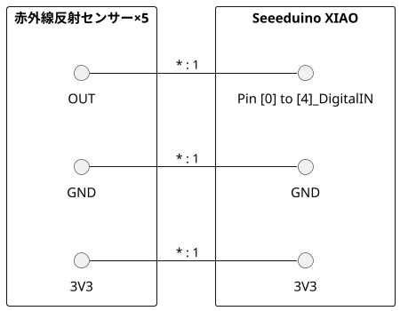

## Photosensors(人感センサー)

### 用意したもの

* Seeeduino XIAO
* 赤外線反射センサー
  * 安いものは30cmぐらいの検知距離のものが購入可能。最大8mまでは確認済み

### 配線

### 動作

* 赤外線反射センサーに反応があったらUARTに「detection」を表示
* 検知中は基板上のLED点灯
* １秒感覚で動作の判定（検知／非検知）を行う
* 距離の設定は赤外線反射センサーの可変抵抗で行う

### 特記事項

* 横に並べる場合は中心がもっとも検知距離が遠い山なりが良い感じに検知していた。
* 検知距離を一定以上にすると横の制外線反射センサーを常時検知するためカバーなので物理的に届かないようにするか話す必要がある。
