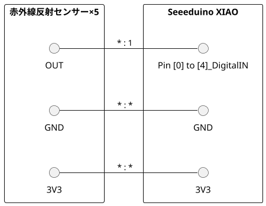

## Photo_sensors(人感センサー)

### 用意したもの

* Seeeduino XIAO
* 赤外線反射センサー
  * 安いものは30cmぐらいの検知距離のものが購入可能。最大8mまでの製品があることを確認済み


### 配線



### 動作

* 距離の設定は赤外線反射センサーの可変抵抗で行う
* settings.hppで定義したLOOP_DELAY_MS(100ms)間隔で判定ロジックが動作する
* 検知状態
  * UARTに検知/検知なしを表示する
    * 指定時間(DETECTION_WAITING_TIME_MS)経過後も検知し続けていたら"文字列(TODO:loop()関数にて定義)"を表示する
    * 検知後に指定時間(DETECTION_RELEASE_TIME_MS)経過しても検知が無かったら「-」を表示する
  * LED_LIGHTING_ON_BOARDが1ならば検知中は基板上のLED点灯

|文字列|定義状態|
|:--:|:--|
| '-' | ロスト状態 |
| '<' | 1番目検知 |
| '>' | 2番目検知 |
| 未定義 | 3番目検知 |
| 未定義 | 4番目検知 |
| 未定義 | 5番目検知 |
| '\|' | 1番目検知 と 2番目検知 |


### 設定

#### PINのLOW/HIGH

検知した時のLOW/HIGHの判定は下記の変数で設定している。

```c++
// LOWの時に検知した
const uint8_t PIN_OUTPUT_STATUS = LOW;
```

#### 判定に使うPINの設定

platformioの定義ファイル```platformio.ini```に記載のbuild_flagでPinNoを指定できる。未定義の場合は動作しない

```text
build_flags =
	-DDETECTION_PIN_NUMBER_1=8
	-DDETECTION_PIN_NUMBER_2=9
```

#### 検知時間の制御

platformioの定義ファイル```platformio.ini```に記載のbuild_flagで検知時間を制御できる。

* DETECTION_WAITING_TIME_MS : 検知開始までの時間
* DETECTION_RELEASE_TIME_MS : 検知後、見失うと判定するまでの時間

```text
build_flags =
	-DDETECTION_WAITING_TIME_MS=500
	-DDETECTION_RELEASE_TIME_MS=1500
```

#### 検知したときのボードのLED点灯

検知したときにボードのLEDを制御している。
を点灯させたくない場合は下記のコードを'0'に変更する。
platformioの定義ファイル```platformio.ini```に記載のbuild_flagで制御できる。未定義の場合は非制御(点灯しない)となる。

```text
build_flags =
	-DLED_LIGHTING_ON_BOARD=1
```


### 特記事項

* loop()には1pinと2pinの制御しかいれてない。
* 横に並べる場合は中心から凸型になるように検知距離にすると良い感じに検知していた。
* 検知距離を一定以上にすると横の赤外線反射センサーを常時検知するためカバーなので物理的に届かないようにするか話す必要がある。
