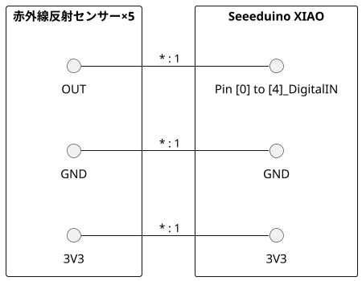

## TestBoard_A

### 用意したもの

* Seeeduino XIAO
* 赤外線反射センサー
* OLED
* BLE


### 配線



### 動作

* 距離の設定は赤外線反射センサーの可変抵抗で行う
* 100ms間隔(LOOP_DELAY_MS)で判定ロジックが動作する
* 検知状態
  * UARTに検知/検知なしを表示する
    * 指定時間(DETECTION_WAITING_TIME_MS)経過後も検知し続けていたら「detection」を表示する
    * 検知後に指定時間(FLAG_RELEASE_TIME_MS)経過しても検知が無かったら「lost」を表示する
  * LED_LIGHTING_ON_BOARDが1ならば検知中は基板上のLED点灯


### 設定

#### PINのLOW/HIGH

検知した時のLOW/HIGHの判定は下記の変数で設定している。

```c++
// LOWの時に検知した
const uint8_t PIN_OUTPUT_STATUS = LOW;
```

#### 判定に使うPINの設定

Pin0～4までの５つで行ている。
下記のコードを'0'にすれば判定をしない。

```c++
#define DETECTION_ENABLE_01 1
#define DETECTION_ENABLE_02 1
#define DETECTION_ENABLE_03 1
#define DETECTION_ENABLE_04 1
#define DETECTION_ENABLE_05 1
```

PINの位置を変更したい場合は下記のコードでPIN番号を設定する。

```c++
const int DigitalAnalogPin_1 = 0;
const int DigitalAnalogPin_2 = 1;
const int DigitalAnalogPin_3 = 2;
const int DigitalAnalogPin_4 = 3;
const int DigitalAnalogPin_5 = 4;
```

#### 検知したときのボードのLED点灯

検知したときにLEDを点灯させたくない場合は下記のコードを'0'に変更する。

```c++
#define LED_LIGHTING_ON_BOARD 1
```


### 初期設定

#### RN4020の設定手順

UARTで初期設定をしたものをご利用ください。

* 子機

```bash
+
SF,1
SR,32000000
R,1
LW
WC
WW
```

スクリプト編集モードへ移行したら下記のテキストを書き込んでください。終了したらESCでぬけてください。


```text
@PW_ON

@CONN
I

@DISCON
R,1
```


```bash
LW
SR,33000000
R,1
```


* 親機


```bash
SF,1
SR,92000000
R,1

F
// RNxxxx の先頭のIDを取得します。
0491621AE635,0,RNE635,00035B0358E607DD021A08123A000300,-35
X

LW
WC
WW
```

```text
@PW_ON
E,0,0491621AE635

@CONN
I

@DISCON
R,1
```

```bash
LW
SR,93000000
R,1
```

### 特記事項

* 横に並べる場合は中心から凸型になるように検知距離にすると良い感じに検知していた。
* 検知距離を一定以上にすると横の赤外線反射センサーを常時検知するためカバーなので物理的に届かないようにするか話す必要がある。
